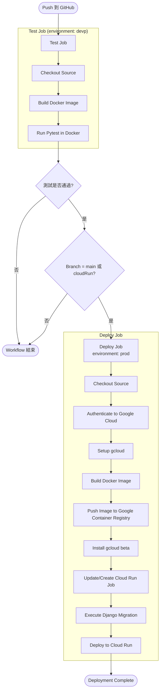

# Introduction 專案介紹
* 專案名稱: 台灣整合企業形象網站
* 功能: 靜態網站、訂單系統

## Table of Contents 目錄
- [Introduction 專案介紹](#introduction-專案介紹)
  - [Table of Contents 目錄](#table-of-contents-目錄)
  - [Tech Stack 技術架構](#tech-stack-技術架構)
  - [Project Structure 專案架構](#project-structure-專案架構)
  - [Quick Start 使用方式](#quick-start-使用方式)
    - [Run 啟動專案](#run-啟動專案)
      - [venv](#venv)
      - [uv](#uv)
    - [Testing 測試](#testing-測試)
      - [venv](#venv-1)
      - [uv](#uv-1)
  - [Apps 子應用](#apps-子應用)
  - [URLs 路由](#urls-路由)
  - [Models 模型](#models-模型)
    - [pages](#pages)
    - [quotations](#quotations)
  - [API](#api)
  - [Deployment 部署方式](#deployment-部署方式)
    - [部署順序](#部署順序)
  - [To Do List](#to-do-list)
  - [Changelog](#changelog)
    - [2026-05-26](#2026-05-26)
    - [2026-05-14](#2026-05-14)
    - [2026-05-12](#2026-05-12)
  - [FAQ 常見問題](#faq-常見問題)

## Tech Stack 技術架構
| 套件 / 工具 | 版本 | 用途 |
|------------|-------|------|
| Python | 3.10.0 | 程式語言 |
| Django | 5.1.7 | Web Framework |
| Factory_boy | 3.3.3 | 模型工廠（測試） |
| Gunicorn | 23.0.0 | WSGI 應用伺服器 |
| Pytest | 9.0.2 | 測試框架 |
| Whitenoise | 6.11.0 | 渲染靜態資源 |

## Project Structure 專案架構
```plaintext
.
├── .env                    # 環境變數設定
├── .env.example            # 環境變數模板
├── .github/                # GitHub Actions設定
|
├── README.md               # 專案說明文件
├── Dockerfile              # Docker 建置設定
├── requirements.txt        # Python 套件相依列表
├── db.sqlite3              # SQLite 本地開發資料庫
├── manage.py               # Django 管理入口
├── pytest.ini              # pytest 測試設定
|
├── core/                   # Django 專案核心設定
│   ├── settings.py         # Django 設定
│   ├── urls.py             # 全域 URL 路由
│   ├── asgi.py             # ASGI 入口
│   ├── wsgi.py             # WSGI 入口
│   └── jinja2_env.py       # Jinja2 環境設定
├── pages/                  # 網站靜態頁面 App
├── quotations/             # 報價管理 App
|
├── staticfiles/            # collectstatic 輸出的靜態檔案
└── templates/              # 全域 HTML 模板
    ├── 404.html            # 404 錯誤頁面
    └── admin/              # Django Admin 客製化模板
```

## Quick Start 使用方式

### Run 啟動專案
venv與uv擇一使用即可。

#### venv
1. 複製專案至本地端
    ```bash
    git clone https://github.com/asfm4001/Taiwan-IDP.git
    ```

2. 進入專案
   ```bash
   cd Taiwan-IDP
   ```
    
3. 初始化本地端環境變數
   ```bash
   cp .env.example .env
   ```
    
4. 建立虛擬環境
   ```bash
   python3 -m venv .venv
   ```
    
5. 啟用虛擬環境
   ```bash
   source .venv/bin/activate
   ```
    
6. 安裝套件
   ```bash
   pip install -r requirements.txt
   ```
    
7. 資料庫遷移
   ```bash
   python3 manage.py migrate
   ```
    
8. 運行Django開發伺服器
   ```bash
   python3 manage.py runserver
   ```
    
9. 瀏覽開發伺服器 http://localhost:8000

10. 停止開發伺服器 <kbd>ctrl</kbd> + <kbd>c</kbd>
11. 退出虛擬環境
    ```bash
    deactivate
    ```

#### uv
1. 複製專案至本地端
   ```bash
   git clone https://github.com/asfm4001/Taiwan-IDP.git
   ```
    
2. 進入專案
   ```bash
   cd Taiwan-IDP
   ```
    
3. 初始化本地端環境變數
   ```bash
   cp .env.example .env
   ```
    
4. 初始化uv
   ```
   uv init
   ```
    
5. 建立虛擬環境並安裝基本工具
   ```bash
   uv venv --seed
   ```
    
6. 依`requirements.txt`同步套件
   ```bash
   uv pip sync requirements.txt
   ```
    
7. 資料庫遷移
   ```bash
   uv run manage.py migrate
   ```
    
8. 運行Django開發伺服器
   ```bash
   uv run manage.py runserver
   ```
    
9. 瀏覽開發伺服器 http://localhost:8000

10. 停止開發伺服器 <kbd>ctrl</kbd> + <kbd>c</kbd>
    

### Testing 測試

#### venv
1. `pytest`
    > 若已**退出虛擬環境**，須先再次**啟用虛擬環境**

#### uv
1. `uv run pytest`

## Apps 子應用
| App | 功能 | 文件 |
|-----|------|------|
| `core` | 核心 App，包含設定檔、主路由及 WSGI/ASGI 入口。 | - |
| `pages` | 靜態網站。 | [📄](docs/pages.md) |
| `quotations` | 後台訂單系統。 | [📄](docs/quotations.md) |

## URLs 路由
| 路由 (URL) | 頁面 |
|------------|------|
| `/` | 首頁 |
| `/about/` | 關於我們 |
| `/services/` | 技術服務 |
| `/instances/` | 工程實績 |
| `/contact/` | 聯繫我們 |
| `/quotations/` | 訂單 |
| `/admin/` | 後台 |

## Models 模型

### pages
管理靜態頁面。
```plaintext
├── Instance
├── Service
├── Image
└── Article
```

### quotations
管理客戶、產品、報價及訂單。
```plaintext
├── Client
├── Company
├── Product
├── SubProduct
├── Order
├── OrderProduct
├── Article
├── Quotation
├── QuotationProduct
├── WorkType
└── WorkTypeProduct
```

## API
尚未提供RESTful API。

## Deployment 部署方式

### 部署順序


## To Do List
- [ ] 優化`settings.py`
  - [ ] 刪除app中`django_recaptcha`

## Changelog

### 2026-05-26
* 調整`services`URL

### 2026-05-14
* 將`pages.service`改回FBV，並將資料暫存至`/data`
* 調整`pages`版面

### 2026-05-12
* 將Google Cloud Run轉址至[https://taiwan-idp.com/](taiwan-idp.com/)，保留原Cloud Run網址
* 修正Django4.0以上`CSRF_TRUSTED_ORIGINS`需新增前綴"https://"

## FAQ 常見問題
**N/A**
